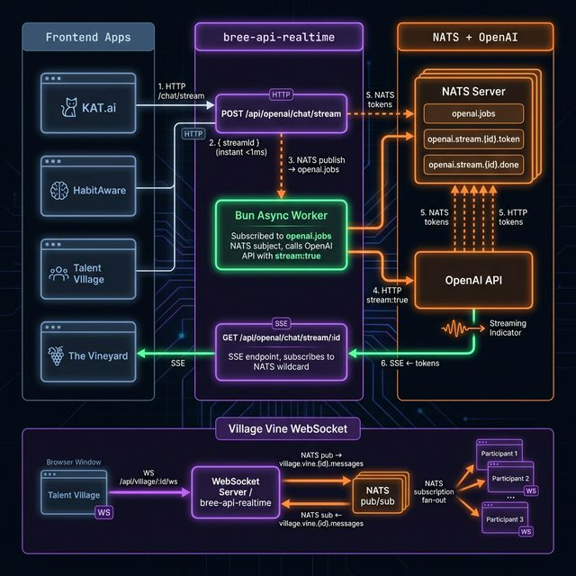

# bree-api-realtime

The **real-time plane** of the BREE AI platform. Owns all WebSocket, Server-Sent Events (SSE), and NATS pub/sub traffic — keeping long-lived connections completely isolated from the data plane (`bree-api`).

---

## Architecture Diagram



---

## The Two Pipelines

### 1. OpenAI NATS Streaming (SSE)

The old `bree-api` chat endpoint was fully **blocking** — one HTTP connection held open for the entire OpenAI response (10–30 seconds). This has been replaced with a decoupled 3-step pipeline:

```
Frontend               bree-api-realtime              NATS          OpenAI
   │                          │                          │              │
   │──POST /chat/stream──────►│                          │              │
   │◄── { streamId } ─────── │  (instant, <1ms)         │              │
   │                          │──publish openai.jobs────►│              │
   │                          │                          │              │
   │                    [Bun Worker]                     │              │
   │                          │◄─subscribe openai.jobs──│              │
   │                          │──────────────────────────────stream:true►│
   │                          │                          │◄──token─────│
   │                          │◄─────────────────────────│  (each tok) │
   │                          │──publish stream.{id}.token►│           │
   │                          │                          │              │
   │──GET /stream/:streamId──►│                          │              │
   │                          │◄─subscribe stream.{id}.*─│             │
   │◄══ SSE: event:token ════│ (token arrives)          │              │
   │◄══ SSE: event:token ════│                          │              │
   │◄══ SSE: event:done  ════│                          │              │
```

#### Step 1 — Submit (`POST /api/openai/chat/stream`)

Returns `{ streamId }` **immediately** (<1ms). The job is published to the NATS subject `openai.jobs`. The HTTP connection closes.

```ts
const { streamId } = await fetch(`${REALTIME_URL}/api/openai/chat/stream`, {
  method: "POST",
  body: JSON.stringify({ query, context, options }),
}).then((r) => r.json());
```

#### Step 2 — Bun Async Worker

A long-lived async task started at boot subscribes to `openai.jobs`. Each incoming job spawns a new `processStreamJob()` Promise — Bun's event loop runs all concurrently with zero blocking.

```
openai.jobs  →  processStreamJob(job)
                 └─ fetch OpenAI (stream: true)
                      └─ each token → NATS publish openai.stream.{id}.token
                      └─ on [DONE]  → NATS publish openai.stream.{id}.done
```

#### Step 3 — SSE Endpoint (`GET /api/openai/chat/stream/:streamId`)

A `ReadableStream` backed `Response` subscribes to the NATS wildcard `openai.stream.{streamId}.*`. Each NATS message becomes an SSE event pushed to the browser. When the client disconnects, the NATS subscription is cleaned up immediately via the `cancel()` handler.

```
SSE Event Types
───────────────
event: connected  → stream is open, {streamId}
event: token      → {token: "...", streamId: "..."}   (one per OpenAI chunk)
event: done       → {streamId: "..."}                 (stream complete)
event: error      → {error: "..."}                    (OpenAI or NATS error)
```

#### NATS Subjects (OpenAI)

| Subject                    | Publisher                 | Subscriber            |
| -------------------------- | ------------------------- | --------------------- |
| `openai.jobs`              | `POST /chat/stream` route | Bun worker            |
| `openai.stream.{id}.token` | Bun worker                | SSE `GET /stream/:id` |
| `openai.stream.{id}.done`  | Bun worker                | SSE `GET /stream/:id` |
| `openai.stream.{id}.error` | Bun worker                | SSE `GET /stream/:id` |

---

### 2. Village Vine WebSocket + NATS

Real-time chat for an active Talent Village session. Multiple participants (Lead, Experts, Candidate) all connect to the same vine via WebSocket. Messages are published to NATS and fan-out to all subscribers simultaneously.

```
Participant A (WS)                    bree-api-realtime                NATS
       │                                      │                           │
       │──WS connect /api/village/{id}/ws────►│                           │
       │                                      │──subscribe vine.{id}.*───►│
       │──WS message {type:"message"}────────►│                           │
       │                                      │──publish vine.{id}.msgs──►│
       │                                      │                           │
                                              │◄─message (fan-out)────────│
       │◄──WS message (type:"message")────────│  (to ALL subscribers)     │
Participant B◄──WS message────────────────────│                           │
Participant C◄──WS message────────────────────│                           │
```

#### WebSocket lifecycle

| Event                  | What happens                                                      |
| ---------------------- | ----------------------------------------------------------------- |
| `open`                 | Validate invite list, mark name as claimed, subscribe to NATS     |
| `message.type=ping`    | Reply `{type:"pong"}` — keeps connection alive through Fly proxy  |
| `message.type=message` | Publish to NATS + persist to SQLite/Postgres via `conversationDb` |
| `close`                | Remove name from claimed set, unsubscribe from NATS               |

#### NATS Subjects (Village Vine)

| Subject                      | Publisher            | Subscriber                       |
| ---------------------------- | -------------------- | -------------------------------- |
| `village.vines.created`      | `POST /start`        | AgentX collective agents         |
| `village.vine.{id}.messages` | WS `message` handler | All WS connections for that vine |

---

## Bun Concurrency Model

The key insight is that **Bun's event loop handles all concurrent async operations natively** — no worker threads needed.

```
Bun Process
├─ HTTP server (Elysia)           — handles WS upgrades + SSE + REST
├─ NATS subscriber: openai.jobs   — long-lived, fires processStreamJob()
├─ processStreamJob(job-1)        ─── concurrent Promise
├─ processStreamJob(job-2)        ─── concurrent Promise
├─ processStreamJob(job-3)        ─── concurrent Promise
└─ WS connections [N]             — each with its own NATS subscription
```

Each `processStreamJob` reads from OpenAI's streaming response using `reader.read()` in a `while(true)` loop — this is a standard Bun-native async generator pattern that yields control back to the event loop on each `await`, allowing other jobs and WS handlers to run in parallel.

---

## Frontend Integration

All four apps consume this via `@bree-ai/core`:

```ts
// Progressive token rendering
import { useOpenAIStream } from "@bree-ai/core";

const { ask, response, isStreaming, abort } = useOpenAIStream({
  systemPrompt: "You are KAT.ai...",
});

// response updates on every token — no waiting for full response
await ask(userQuery, ragContext);
```

```ts
// Direct API (no React)
import { generateChatResponseStream } from "@bree-ai/core";

const fullText = await generateChatResponseStream(
  query,
  context,
  options,
  (token, accumulated) => render(accumulated), // called per token
  (fullText) => save(fullText), // called on done
);
```

---

## Routes

| Method | Path                           | Auth | Description                           |
| ------ | ------------------------------ | ---- | ------------------------------------- |
| `GET`  | `/health`                      | none | Health check                          |
| `POST` | `/api/openai/chat/stream`      | none | Submit streaming job → `{ streamId }` |
| `GET`  | `/api/openai/chat/stream/:id`  | none | SSE token stream                      |
| `POST` | `/api/openai/chat`             | none | Legacy blocking chat (deprecated)     |
| `GET`  | `/api/agents`                  | JWT  | Discover NATS agents                  |
| `GET`  | `/api/agents/:id`              | JWT  | Get agent status                      |
| `POST` | `/api/agents/:id/message`      | JWT  | Send message to agent                 |
| `WS`   | `/api/agents/:id/ws`           | none | Agent terminal stream                 |
| `POST` | `/api/village/start`           | JWT  | Create village vine                   |
| `POST` | `/api/village/:id/message`     | JWT  | Send message (REST)                   |
| `GET`  | `/api/village/:id/messages`    | JWT  | Message history                       |
| `WS`   | `/api/village/:id/ws`          | none | Real-time village vine                |
| `POST` | `/api/village/send-invite-sms` | JWT  | SMS invite via Twilio                 |
| `GET`  | `/api/village/contacts`        | JWT  | List contacts                         |

---

## Environment Variables

| Variable              | Required | Description                                  |
| --------------------- | -------- | -------------------------------------------- |
| `NATS_URL`            | ✅       | NATS server URL (`nats://...`)               |
| `NATS_USER`           | optional | NATS auth user                               |
| `NATS_PASSWORD`       | optional | NATS auth password                           |
| `NATS_TOKEN`          | optional | NATS auth token                              |
| `OPENAI_API_KEY`      | ✅       | OpenAI API key for streaming worker          |
| `JWT_SECRET`          | ✅       | Shared JWT signing secret (same as bree-api) |
| `AUTH_PROVIDER`       | optional | `identity-zero` (default) or `better-auth`   |
| `DATABASE_URL`        | optional | Postgres URL (falls back to SQLite)          |
| `DB_PATH`             | optional | SQLite path (default: `bree.db`)             |
| `TWILIO_SID`          | optional | Twilio account SID for SMS invites           |
| `TWILIO_TOKEN`        | optional | Twilio auth token                            |
| `TWILIO_PHONE_NUMBER` | optional | Twilio sending number                        |
| `PORT`                | optional | HTTP port (default: `3001`)                  |
| `DEMO_MODE`           | optional | `true` bypasses auth for all routes          |

---

## Why This Split Matters

| Concern           | bree-api (data plane)       | bree-api-realtime             |
| ----------------- | --------------------------- | ----------------------------- |
| Connection type   | Request/response            | Long-lived (WS, SSE)          |
| Blocking risk     | High (OpenAI, DB)           | None — NATS async             |
| Scale bottleneck  | CPU (AI inference proxying) | Memory (connection count)     |
| Scaling strategy  | Vertical CPU                | Horizontal (more machines)    |
| Fly machine size  | 1 CPU, 1GB                  | 1 CPU, 512MB                  |
| Concurrency model | Bun event loop              | Bun event loop + NATS fan-out |
