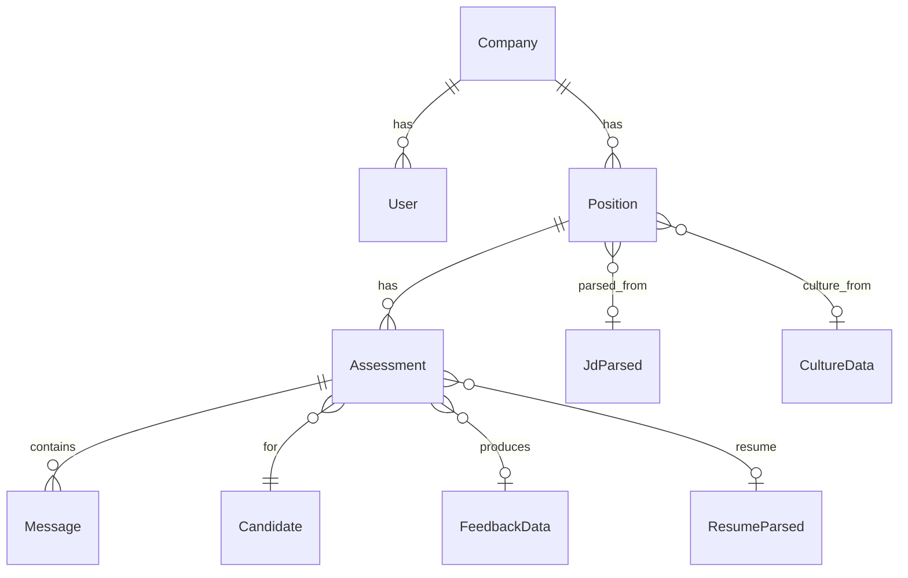

# Geni Domain Model (DDD)

AI-agent-oriented domain model. **Generated from** [business.agentx.md](business.agentx.md). Single source of truth for domain objects, domain values, and relationships. Drives → Zod schemas, TypeScript types, PostgreSQL tables.

---

## Domain Object Relationship Overview



---

## Core Domain Objects

### Company

| Field | Type | Description |
|-------|------|-------------|
| id | string (UUID) | Primary key |
| name | string | Company name |
| domain | string? | Company domain (e.g. `acme.com`) |
| website | string? | Company website URL |
| subscription_tier | string | `professional` (default) |
| api_key | string? | API key for integrations |
| created_at | datetime | |
| updated_at | datetime | |

---

### User

App users (recruiters/staff) with permission levels.

| Field | Type | Description |
|-------|------|-------------|
| id | string (UUID) | Primary key |
| company_id | string? | FK to Company |
| email | string | Unique, email format |
| name | string? | Display name |
| user_role | string | `view_only` \| `editor` \| `administrator` |
| password_hash | string? | Bcrypt hash |
| status | string | `active` \| `inactive` |
| last_login | string? | ISO datetime |
| created_at | string | ISO datetime |
| updated_at | string? | ISO datetime |

**Constants:** `USER_ROLES = ("view_only", "editor", "administrator")`

---

### Position (Job / Role)

Job posting created by recruiter. Replaces legacy `Role` domain object.

| Field | Type | Description |
|-------|------|-------------|
| id | string (UUID) | Primary key |
| company_id | string | FK to Company |
| title | string | Job title |
| description | string? | Job description |
| requirements | object? | Legacy requirements blob |
| status | string | `active` \| `paused` \| `closed` |
| created_by | string? | FK to User |
| assessment_link | string? | Public assessment URL |
| scoring_weights | ScoringWeights? | Pillar weights |
| jd_original | string? | Raw job description text |
| jd_parsed | JdParsed? | Parsed JD data |
| culture_data | CultureData? | Scraped culture info |
| questions | Question[]? | Generated assessment questions |
| branding | object? | Company branding overrides |
| score_ranges | ScoreRanges? | Advance/pipeline/suggest/reject thresholds |
| job_genie_references | string[]? | URLs for Job Geni context |
| created_at | string | ISO datetime |
| updated_at | string? | ISO datetime |

---

### Assessment

Candidate assessment for a position.

| Field | Type | Description |
|-------|------|-------------|
| id | string (UUID) | Primary key |
| position_id | string | FK to Position |
| candidate_email | string | Candidate email |
| candidate_name | string? | Candidate name |
| status | string | `in_progress` \| `completed` \| `abandoned` |
| started_at | datetime | |
| completed_at | datetime? | |
| overall_score | int? | 0–100 |
| technical_score | int? | 0–100 |
| cultural_score | int? | 0–100 |
| experience_score | int? | 0–100 |
| market_score | int? | 0–100 |
| conversation_data | object? | Messages, phases, state |
| feedback_data | FeedbackData? | Generated feedback |
| resume_file_path | string? | Path to uploaded resume |
| resume_parsed_data | ResumeParsed? | Parsed resume |
| resume_uploaded_at | datetime? | |
| recruiter_status | string? | `reviewing` \| `advanced` \| `rejected` |
| recruiter_notes | string? | |
| duration_seconds | int? | |
| created_at | datetime | |
| updated_at | datetime | |

---

### Message

Single message in an assessment conversation.

| Field | Type | Description |
|-------|------|-------------|
| id | string (UUID) | Primary key |
| assessment_id | string | FK to Assessment |
| role | string | `assistant` \| `user` |
| content | string | Message text |
| phase | string? | Conversation phase |
| timestamp | datetime | |

---

## Domain Values & Embedded Types

### ScoringWeights

Pillar weights must sum to 100. (From business: Technical 40%, Cultural 25%, Experience 20%, Market 15%)

| Field | Type | Default |
|-------|------|---------|
| technical | int | 40 |
| cultural | int | 25 |
| experience | int | 20 |
| market | int | 15 |

---

### ScoreRanges

Position score thresholds for UI (advance, pipeline, suggest, reject).

| Field | Type | Default |
|-------|------|---------|
| advance | int | 85 |
| pipeline_min | int | 70 |
| pipeline_max | int | 84 |
| suggest_min | int | 60 |
| suggest_max | int | 69 |
| reject_max | int | 59 |

---

### JdParsed

Output of JD parser agent.

| Field | Type | Description |
|-------|------|-------------|
| title | string | Job title |
| industry | string | e.g. `healthcare`, `general` |
| required_skills | RequiredSkill[] | Skills with level, weight, test_method |
| experience_years | { min: int, max: int } | e.g. `{ min: 3, max: 5 }` |
| responsibilities | string[] | |
| nice_to_haves | string[] | |
| work_style | string | |
| communication_style | string | |
| cultural_traits | CulturalTrait[] | |
| deal_breakers | string[] | |
| salary_range | string? | |
| location | string | |
| remote_policy | string | |

---

### RequiredSkill

| Field | Type | Description |
|-------|------|-------------|
| skill | string | Skill name |
| level | int | 1–5 |
| weight | string | `high` \| `medium` \| `low` |
| test_method | string | e.g. `Problem solving`, `Verification` |

---

### CulturalTrait

| Field | Type | Description |
|-------|------|-------------|
| trait | string | Trait name |
| importance | string | `critical` \| `high` \| `medium` |
| red_flag | string? | |

---

### CultureData

Output of culture scraper agent.

| Field | Type | Description |
|-------|------|-------------|
| values | string[] | Company values |
| work_style | object | |
| perks | string[] | |
| team_size | string | |
| tech_stack | string[] | |
| keywords | string[] | |
| cultural_traits | (string \| CulturalTrait)[] | |

---

### Question

Generated assessment question.

| Field | Type | Description |
|-------|------|-------------|
| question | string | Question text |
| dimension | string | `technical` \| `cultural` \| `experience` \| `scenario` |
| related_to | string | Skill or topic |
| weight | int | 1–10 |

---

### FeedbackData

Generated feedback for completed assessment.

| Field | Type | Description |
|-------|------|-------------|
| overall_summary | string[] | Bullet summary |
| skill_breakdown | { technical: string[], cultural: string[], experience: string[], market: string[] } | |
| strengths | string[] | 4–6 bullets |
| improvements | string[] | 3–5 bullets |
| next_steps | { message: string, timeline: string, options: string[] } | |
| ai_recommendation | { action: string, summary: string } | Action: `advance`, `pipeline`, `suggest`, `reject` |

---

### ResumeParsed

Output of resume parser.

| Field | Type | Description |
|-------|------|-------------|
| skills | string[] | |
| work_experience | WorkExperience[] | |
| years_experience | int? | |
| summary | string? | |
| parse_error | string? | If parse failed |

---

### WorkExperience

| Field | Type | Description |
|-------|------|-------------|
| title | string | Job title |
| company | string | Company name |
| achievements | string[]? | |

---

## Status Enums

| Domain Object | Field | Values |
|---------------|-------|--------|
| User | status | `active`, `inactive` |
| User | user_role | `view_only`, `editor`, `administrator` |
| Position | status | `active`, `paused`, `closed` |
| Assessment | status | `in_progress`, `completed`, `abandoned` |
| Assessment | recruiter_status | `reviewing`, `advanced`, `rejected` |
| Message | role | `assistant`, `user` |

---

## Derivation Flow

```
business.agentx.md  (this document)
         │
         ▼
   agentx.ddd.md    (domain model)
         │
         ├──→ Zod schemas (@geni/domain)
         ├──→ TypeScript types (z.infer)
         └──→ PostgreSQL tables
```

---

## Related

| Document | Purpose |
|----------|---------|
| [business.agentx.md](business.agentx.md) | Business context (source) |
| [README.md](README.md) | Design tenet and document flow |
