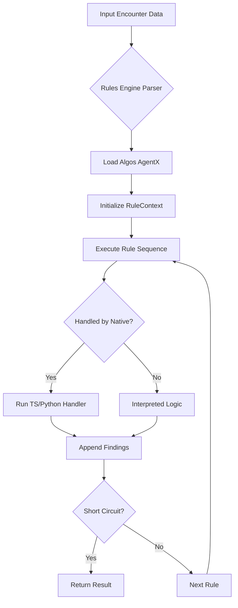

---
agentx:
  version: 1
  created_at: "2026-03-13T14:05:00Z"
  type: architecture
  filename: playbook-orchestration-architecture.agentx.md
---

# Playbook-AI Orchestration Flow

> **Definition:** The high-level architecture for processing clinical encounters using a hybrid approach: **Generative (Descriptive)** intelligence for extraction and **Deterministic (Rules Engine)** logic for validation.

---

## 1. Unified Analysis Pipeline

The Orchestrator executes a three-phase pipeline to transform raw clinical documentation into validated coding artifacts.

### Phase 1: Descriptive AI Analysis (The Discovery)
- **Source:** `*.playbook.agentx.md` (Clinical guidelines, CPT/ICD definitions).
- **Process:** The LLM (gpt-4o) acts as a high-precision reader. It consumes the Playbook context and the user’s documentation to perform:
  - **Entity Extraction:** Identifying diagnoses, procedures, and time spent.
  - **Inference:** Suggesting E/M levels (MDM) based on descriptive patterns in the playbook.
- **Output:** A "Draft Encounter Object" (unvalidated).

### Phase 2: Deterministic Rules Engine (The Guardrail)
- **Source:** `*.algos.agentx.md` (Formalized logic gates, tables, and short-circuit rules).
- **Process:** The **Rules Engine Core** (`executor.ts`) takes the Draft Encounter Object and executes a sequence of strictly defined rules:
  - **Native Handlers:** TypeScript/Python functions (e.g., `perfusionGate`, `serialMeasurementIntegrity`) that check specific data thresholds (ABI values, days between visits).
  - **Short-circuiting:** If a critical "Block" rule fails (e.g., missing signature), execution stops immediately with a `CLAIM_BLOCK` status.
- **Output:** A `ValidationResult` containing `Findings` (Errors, Warnings, Remediation).

### Phase 3: Conflict Reconciliation
- **Source:** `ContradictionEngine` within the Rules Engine.
- **Process:** Compares the AI’s generative extraction with the deterministic rules output.
  - *Example:* AI extracts Stage 4 Pressure Ulcer (Descriptive); Rules Engine identifies a conflict because the documented ICD-10 code is for Stage 2 (Deterministic).
- **Output:** Final Validated Response with suggested remediation.

---

## 2. Technical Component Mapping

| Component | Responsibility | AgentX Source | Implementation |
|-----------|----------------|---------------|----------------|
| **Orchestrator** | Pipeline flow control & prompt construction | N/A | `server.ts` |
| **Playbook Loader** | Versioned discovery of specialty notes | N/A | `playbook-loader.ts` |
| **Generative LLM** | Descriptive analysis & drafting | `playbook.agentx.md` | OpenAI API (gpt-4o) |
| **Rules Engine** | Deterministic validation & logic execution | `algos.agentx.md` | `core/executor.ts` |
| **Specialty Adapters**| Native handlers for clinical thresholds | N/A | `specialties/.../handlers.ts` |

---

## 3. The Rules Engine State Machine

The flow inside the deterministic analysis uses a generalized `RuleContext`:

---

## 4. Unification Strategy

- **Domain Agnostic:** The engine does not distinguish between `wound-ai` and `enm-ai` at the core level. 
- **Configuration Switches:** Mode can be toggled via `mode: "agentx"` (interpreting MD rules) or `mode: "typescript"` (hardcoded performance path).
- **Standardized Artifacts:** All intelligence resides in `agentx/apps/{domain}/`, allowing the orchestrator to load specialty logic dynamically based on the request metadata.
