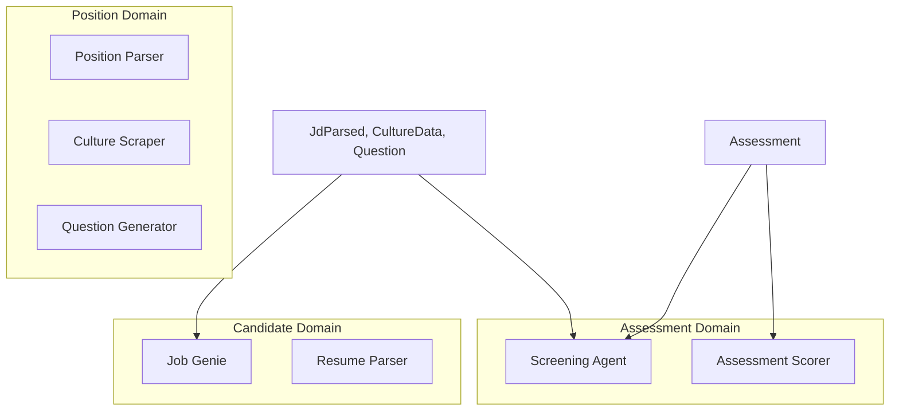

# Domain-Based AI Agents

Agent-oriented plan for restructuring Geni's AI agents around domain boundaries. Agents consume and produce domain types, use domain language, and align with the [domain model](domain.agentx.md).

**Part of:** [Zod Domain Driven Design](README.md) — driven by [zod-domain.agentx.md](zod-domain.agentx.md)

---

## Domain Model Reference

**Source of truth:** [domain.agentx.md](domain.agentx.md)

**Domain types:** [domain-classes.agentx.md](domain-classes.agentx.md) — TypeScript types from `z.infer<typeof XSchema>`

Domain entities: Company, User, Position, Assessment, Message, Candidate (implicit). Value objects: JdParsed, CultureData, Question, FeedbackData, ResumeParsed, ScoringWeights, ScoreRanges, DetailedScores.

---

## Current vs Domain-Based

| Current | Domain-Based |
|---------|--------------|
| Agents named by technical function (`jd_parser_agent`, `scoring_agent`) | Agents named by domain capability (`PositionParser`, `AssessmentScorer`) |
| Inputs: raw dicts, ad-hoc `role_context` | Inputs: domain types (Position, Assessment, Candidate) |
| Outputs: loose JSON/dicts | Outputs: domain value objects (JdParsed, FeedbackData) |
| Prompts use generic terms | Prompts use domain language (position, candidate, assessment) |
| Agents scattered, no domain grouping | Agents grouped by domain (Position domain, Assessment domain) |

---

## Domain Boundaries



---

## Domain Agent Mapping

| Current Agent | Domain | New Name | Primary Input | Primary Output |
|---------------|--------|----------|--------------|----------------|
| jd_parser_agent | Position | **PositionParser** | raw JD text, Company.website | [JdParsed](domain.agentx.md#jdparsed) |
| culture_scraper_agent | Position | **CultureScraper** | Company.website | [CultureData](domain.agentx.md#culturedata) |
| question_generator_agent | Position | **QuestionGenerator** | Position (JdParsed + CultureData), ResumeParsed? | [Question](domain.agentx.md#question)[] |
| conversation_agent | Assessment | **ScreeningAgent** | Assessment, Position, Candidate (ResumeParsed) | ConversationState, Message[] |
| scoring_agent | Assessment | **AssessmentScorer** | Assessment (conversation + resume) | [FeedbackData](domain.agentx.md#feedbackdata), [DetailedScores](domain.agentx.md#detailedscores) |
| job_genie_agent | Candidate | **JobGenie** | Position, messages | string (reply) |
| resume_parser (service) | Candidate | **ResumeParser** | file bytes | [ResumeParsed](domain.agentx.md#resumeparsed) |

---

## Domain Agent Contracts

### Position Domain

#### PositionParser

```typescript
// Input
interface PositionParserInput {
  jdText: string;
  companyWebsite?: string;  // From Company
}

// Output: JdParsed (domain type) — validate with JdParsedSchema.parse()
```

#### CultureScraper

```typescript
// Input
interface CultureScraperInput {
  websiteUrl: string;  // From Company.website
}

// Output: CultureData (domain type) — validate with CultureDataSchema.parse()
```

#### QuestionGenerator

```typescript
// Input
interface QuestionGeneratorInput {
  position: Position;       // jd_parsed, culture_data
  candidateResume?: ResumeParsed;  // For personalization
  numQuestions?: number;
}

// Output: Question[] (domain type) — validate with z.array(QuestionSchema).parse()
```

---

### Assessment Domain

#### ScreeningAgent

```typescript
// Input
interface ScreeningAgentInput {
  assessmentId: string;
  assessment: Assessment;   // position_id, candidate_email, conversation_data
  position: Position;      // requirements, culture_data, questions
  candidate: { resume?: ResumeParsed };
  candidateMessage: string;
}

// Output
interface ScreeningAgentOutput {
  messages: Message[];
  currentPhase: string;
  insights: Record<string, unknown>;
  // ... ConversationState fields
}
```

#### AssessmentScorer

```typescript
// Input
interface AssessmentScorerInput {
  assessment: Assessment;  // conversation_data, resume_parsed_data
  position: Position;     // scoring_weights, jd_parsed, culture_data
}

// Output
interface AssessmentScorerOutput {
  scores: {
    overall: number;
    technical: number;
    cultural: number;
    experience: number;
    market: number;
  };
  feedbackData: FeedbackData;  // validate with FeedbackDataSchema.parse()
  detailedScores: DetailedScores;
}
```

---

### Candidate Domain

#### JobGenie

```typescript
// Input
interface JobGenieInput {
  position: Position;  // title, jd_parsed, culture_data, job_genie_references
  messages: { role: string; content: string }[];
  newContent: string;
}

// Output: string (AI reply)
```

#### ResumeParser

```typescript
// Input: file buffer, mime type
// Output: ResumeParsed (domain type) — validate with ResumeParsedSchema.parse()
```

---

## Project Structure (Domain-Based)

```
Geni/backend-ts/src/
├── agents/
│   ├── position/
│   │   ├── PositionParser.ts
│   │   ├── CultureScraper.ts
│   │   └── QuestionGenerator.ts
│   ├── assessment/
│   │   ├── ScreeningAgent.ts
│   │   └── AssessmentScorer.ts
│   ├── candidate/
│   │   ├── JobGenie.ts
│   │   └── ResumeParser.ts
│   └── index.ts
└── ...
```

**Domain types:** Import from `@geni/domain` (see [domain-classes.agentx.md](domain-classes.agentx.md))

---

## Domain Language in Prompts

**Current (generic):**
- "role", "role_context", "requirements"
- "candidate response", "user message"

**Domain-based:**
- "position", "job description", "position requirements"
- "candidate", "candidate response", "candidate resume"
- "assessment", "assessment conversation", "screening interview"
- "company culture", "cultural fit"

Update system prompts and instructions to use domain terminology consistently.

---

## Migration Phases

### Phase 1: Introduce Domain Types

1. Use domain types from `@geni/domain` (Zod-inferred types)
2. Add input/output interfaces for each agent
3. Keep existing agent implementations; add thin adapters that map domain types → current `dict`/`role_context`

### Phase 2: Refactor Agent Signatures

1. Change each agent's public API to accept domain-typed inputs
2. Return domain-typed outputs (JdParsed, FeedbackData, etc.)
3. Validate agent outputs with `XSchema.parse()` before use
4. Update callers (positions, assessments routes, scoring service) to pass domain objects

### Phase 3: Reorganize by Domain

1. Move agents into `position/`, `assessment/`, `candidate/` folders
2. Rename to domain-based names (PositionParser, ScreeningAgent, etc.)
3. Update imports across codebase

### Phase 4: Domain Prompts

1. Audit all prompts for domain language
2. Replace generic terms with domain terms
3. Ensure prompts reference domain entities by name (Position, Assessment, Candidate)

---

## Caller Updates

| Caller | Current | Domain-Based |
|--------|---------|--------------|
| positions route | `parse_job_description(jd_text, website)` | `PositionParser.parse({ jdText, companyWebsite })` |
| positions route | `scrape_company_culture(website)` | `CultureScraper.scrape({ websiteUrl })` |
| assessments route | `conduct_conversation(assessment_id, msg, role_context, state)` | `ScreeningAgent.conduct({ assessmentId, assessment, position, candidate, candidateMessage })` |
| scoring service | `score_assessment(conversation, role, ...)` | `AssessmentScorer.score({ assessment, position })` |
| positions route | `job_genie_reply(position, messages, content)` | `JobGenie.reply({ position, messages, newContent })` |

---

## Benefits

- **Clarity:** Agent purpose tied to domain concept
- **Type safety:** Domain types enforce valid inputs/outputs
- **Testability:** Mock domain objects instead of ad-hoc dicts
- **Consistency:** Single source of truth (domain model) for types
- **Discoverability:** Agents grouped by domain
- **Alignment:** Types from Zod; agents validate outputs with `XSchema.parse()` — stays in sync with [domain-classes](domain-classes.agentx.md) and [domain-postgres](domain-postgres.agentx.md)

---

## Related

| Document | Purpose |
|----------|---------|
| [domain.agentx.md](domain.agentx.md) | Conceptual domain model |
| [zod-domain.agentx.md](zod-domain.agentx.md) | Zod schema-first design; how agents stay aligned |
| [domain-classes.agentx.md](domain-classes.agentx.md) | Zod schemas + TypeScript types (`@geni/domain`) |
| [domain-postgres.agentx.md](domain-postgres.agentx.md) | PostgreSQL schema |
| [../backend.agents.migrate-bun-langchain.agentx.md](../backend.agents.migrate-bun-langchain.agentx.md) | Bun migration |
| [../backend.agents.migrate-bun-native.agentx.md](../backend.agents.migrate-bun-native.agentx.md) | Native Bun migration |
