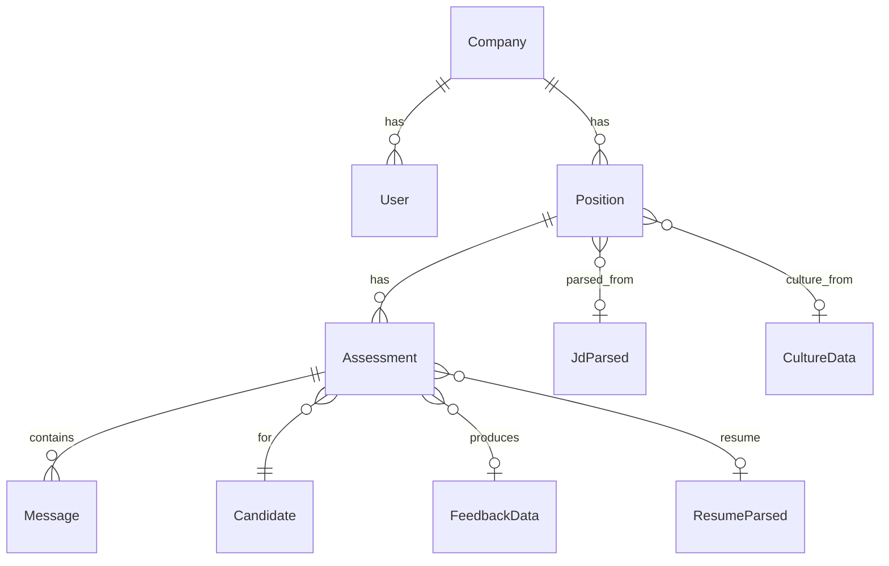

# Domain Classes (Zod Schemas + TypeScript Types)

Agent-oriented plan for defining the Geni domain model in **Zod** as the single source of truth. Zod schemas drive TypeScript types and PostgreSQL schema generation.

**Part of:** [Zod Domain Driven Design](README.md) — driven by [zod-domain.agentx.md](zod-domain.agentx.md)

---

## Summary: One Definition, Three Representations

**Yes.** The whole domain model can be defined in Zod and represented in:

| Representation | How | Source |
|----------------|-----|--------|
| **TypeScript types** | `type X = z.infer<typeof XSchema>` | Zod schema |
| **Runtime validation** | `XSchema.parse(data)` | Zod schema |
| **PostgreSQL** | Zodgres auto-migrate, or codegen script, or manual migrations with mapping table | Zod schema |

Zod yields **plain TypeScript types** (interfaces), not class instances. For class-like behavior (methods, encapsulation), add a thin facade layer that wraps validated data.

---

## Purpose

- **Single source of truth:** Zod schemas define the entire domain model
- **TypeScript types:** Derived via `z.infer<typeof Schema>` — no duplicate type definitions
- **PostgreSQL schema:** Generated from Zod (via Zodgres, custom codegen, or migration scripts)
- **Runtime validation:** Zod validates at API boundaries, DB reads, and agent I/O

---

## Domain Model Reference

**Source of truth:** [domain.agentx.md](domain.agentx.md)

**Current implementation:** `Geni/packages/domain/src/index.ts` (package `@geni/domain`)

---

## Entity Relationship Overview



---

## Architecture: Zod → TypeScript → PostgreSQL

```
┌─────────────────────────────────────────────────────────────────┐
│  Zod Schemas (packages/domain/src/schemas/*.ts)                  │
│  Single source of truth for domain model                         │
└─────────────────────────────────────────────────────────────────┘
         │                                    │
         ▼                                    ▼
┌─────────────────────┐            ┌─────────────────────────────────┐
│  TypeScript Types   │            │  PostgreSQL Schema             │
│  type X = z.infer<  │            │  - Zodgres (auto-migrate)       │
│    typeof XSchema>  │            │  - Custom codegen → SQL          │
│  Used by: API, UI,  │            │  - Manual migrations + mapping  │
│  agents             │            │  table                        │
└─────────────────────┘            └─────────────────────────────────┘
```

---

## Domain Elements → Zod Mapping

### Enums (Status / Role Literals)

| Domain Field | Values | Zod |
|--------------|--------|-----|
| User.user_role | view_only, editor, administrator | `z.enum(["view_only", "editor", "administrator"])` |
| User.status | active, inactive | `z.enum(["active", "inactive"])` |
| Position.status | active, paused, closed | `z.enum(["active", "paused", "closed"])` |
| Assessment.status | in_progress, completed, abandoned | `z.enum(["in_progress", "completed", "abandoned"])` |
| Assessment.recruiter_status | reviewing, advanced, rejected | `z.enum(["reviewing", "advanced", "rejected"])` |
| Message.role | assistant, user | `z.enum(["assistant", "user"])` |

**Pattern:** `z.enum([...])` → TypeScript: `z.infer<typeof UserRoleSchema>`

---

### Entities

| Domain Entity | TypeScript Interface | Key Fields |
|---------------|----------------------|------------|
| **Company** | `Company` | id, name, domain?, website?, subscription_tier, api_key?, created_at, updated_at |
| **User** | `User` | id, company_id?, email, name?, user_role, password_hash?, status, last_login?, created_at, updated_at? |
| **Position** | `Position` | id, company_id, title, description?, requirements?, status, scoring_weights?, jd_parsed?, culture_data?, questions?, score_ranges?, job_genie_references?, created_at, updated_at? |
| **Assessment** | `Assessment` | id, position_id, candidate_email, candidate_name?, status, scores, conversation_data?, feedback_data?, resume_parsed_data?, recruiter_status?, created_at, updated_at? |
| **Message** | `Message` | id, assessment_id, role, content, phase?, timestamp |

---

### Value Objects (Embedded Types)

| Domain Type | TypeScript Interface | Used By |
|-------------|----------------------|---------|
| **ScoringWeights** | `ScoringWeights` | Position |
| **ScoreRanges** | `ScoreRanges` | Position |
| **JdParsed** | `JdParsed` | Position |
| **RequiredSkill** | `RequiredSkill` | JdParsed |
| **CulturalTrait** | `CulturalTrait` | JdParsed, CultureData |
| **CultureData** | `CultureData` | Position |
| **Question** | `Question` | Position |
| **FeedbackData** | `FeedbackData` | Assessment |
| **ResumeParsed** | `ResumeParsed` | Assessment |
| **WorkExperience** | `{ title, company, achievements? }` | ResumeParsed |
| **DetailedScores** | `DetailedScores` | Scoring agent output |

---

## Zod → PostgreSQL Type Mapping

| Zod Type | PostgreSQL | Notes |
|----------|------------|-------|
| `z.string().uuid()` | `UUID` | Primary keys, FKs |
| `z.string()` | `TEXT` or `VARCHAR(n)` | Use `.max(n)` for VARCHAR |
| `z.number().int()` | `INTEGER` | Scores, durations |
| `z.number()` | `NUMERIC` | Weights, decimals |
| `z.boolean()` | `BOOLEAN` | |
| `z.date()` or `z.string().datetime()` | `TIMESTAMPTZ` | ISO datetime |
| `z.enum([...])` | `VARCHAR` + CHECK or native ENUM | Status, role fields |
| `z.object({...})` | `JSONB` | JdParsed, CultureData, FeedbackData, etc. |
| `z.array(z.any())` | `JSONB` | questions, job_genie_references |

**UUID convention:** Use `z.string().uuid()` for all entity IDs. PostgreSQL: `UUID PRIMARY KEY DEFAULT gen_random_uuid()`.

---

## Full Zod Schema Specification

### Enums

```typescript
import { z } from "zod";

export const UserRoleSchema = z.enum(["view_only", "editor", "administrator"]);
export type UserRole = z.infer<typeof UserRoleSchema>;

export const UserStatusSchema = z.enum(["active", "inactive"]);
export type UserStatus = z.infer<typeof UserStatusSchema>;

export const PositionStatusSchema = z.enum(["active", "paused", "closed"]);
export type PositionStatus = z.infer<typeof PositionStatusSchema>;

export const AssessmentStatusSchema = z.enum(["in_progress", "completed", "abandoned"]);
export type AssessmentStatus = z.infer<typeof AssessmentStatusSchema>;

export const RecruiterStatusSchema = z.enum(["reviewing", "advanced", "rejected"]);
export type RecruiterStatus = z.infer<typeof RecruiterStatusSchema>;

export const MessageRoleSchema = z.enum(["assistant", "user"]);
export type MessageRole = z.infer<typeof MessageRoleSchema>;
```

### Value Objects (Dependency Order)

```typescript
// Leaf types first
export const RequiredSkillSchema = z.object({
  skill: z.string(),
  level: z.number().int().min(1).max(5),
  weight: z.enum(["high", "medium", "low"]),
  test_method: z.string(),
});

export const CulturalTraitSchema = z.object({
  trait: z.string(),
  importance: z.enum(["critical", "high", "medium"]),
  red_flag: z.string().optional(),
});

export const ScoringWeightsSchema = z.object({
  technical: z.number().int().min(0).max(100),
  cultural: z.number().int().min(0).max(100),
  experience: z.number().int().min(0).max(100),
  market: z.number().int().min(0).max(100),
}).refine((w) => w.technical + w.cultural + w.experience + w.market === 100, "Weights must sum to 100");

export const ScoreRangesSchema = z.object({
  advance: z.number().int().default(85),
  pipeline_min: z.number().int().default(70),
  pipeline_max: z.number().int().default(84),
  suggest_min: z.number().int().default(60),
  suggest_max: z.number().int().default(69),
  reject_max: z.number().int().default(59),
});

export const JdParsedSchema = z.object({
  title: z.string(),
  industry: z.string(),
  required_skills: z.array(RequiredSkillSchema),
  experience_years: z.object({ min: z.number().int(), max: z.number().int() }),
  responsibilities: z.array(z.string()),
  nice_to_haves: z.array(z.string()),
  work_style: z.string(),
  communication_style: z.string(),
  cultural_traits: z.array(CulturalTraitSchema),
  deal_breakers: z.array(z.string()),
  salary_range: z.string().nullable().optional(),
  location: z.string(),
  remote_policy: z.string(),
});

export const CultureDataSchema = z.object({
  values: z.array(z.string()),
  work_style: z.record(z.unknown()),
  perks: z.array(z.string()),
  team_size: z.string(),
  tech_stack: z.array(z.string()),
  keywords: z.array(z.string()),
  cultural_traits: z.array(z.union([z.string(), CulturalTraitSchema])).optional(),
});

export const QuestionSchema = z.object({
  question: z.string(),
  dimension: z.enum(["technical", "cultural", "experience", "scenario"]),
  related_to: z.string(),
  weight: z.number().int().min(1).max(10),
});

export const FeedbackDataSchema = z.object({
  overall_summary: z.array(z.string()),
  skill_breakdown: z.object({
    technical: z.array(z.string()),
    cultural: z.array(z.string()),
    experience: z.array(z.string()),
    market: z.array(z.string()),
  }),
  strengths: z.array(z.string()),
  improvements: z.array(z.string()),
  next_steps: z.object({
    message: z.string(),
    timeline: z.string(),
    options: z.array(z.string()),
  }),
  ai_recommendation: z.object({
    action: z.enum(["advance", "pipeline", "suggest", "reject"]),
    summary: z.string(),
  }),
});

export const WorkExperienceSchema = z.object({
  title: z.string(),
  company: z.string(),
  achievements: z.array(z.string()).optional(),
});

export const ResumeParsedSchema = z.object({
  skills: z.array(z.string()),
  work_experience: z.array(WorkExperienceSchema),
  years_experience: z.number().int().optional(),
  summary: z.string().optional(),
  parse_error: z.string().optional(),
});

// Export inferred types
export type RequiredSkill = z.infer<typeof RequiredSkillSchema>;
export type CulturalTrait = z.infer<typeof CulturalTraitSchema>;
export type ScoringWeights = z.infer<typeof ScoringWeightsSchema>;
export type ScoreRanges = z.infer<typeof ScoreRangesSchema>;
export type JdParsed = z.infer<typeof JdParsedSchema>;
export type CultureData = z.infer<typeof CultureDataSchema>;
export type Question = z.infer<typeof QuestionSchema>;
export type FeedbackData = z.infer<typeof FeedbackDataSchema>;
export type WorkExperience = z.infer<typeof WorkExperienceSchema>;
export type ResumeParsed = z.infer<typeof ResumeParsedSchema>;
```

### Entities

```typescript
import { UserRoleSchema, UserStatusSchema, PositionStatusSchema, AssessmentStatusSchema, RecruiterStatusSchema, MessageRoleSchema } from "./enums.js";
import { ScoringWeightsSchema, ScoreRangesSchema, JdParsedSchema, CultureDataSchema, QuestionSchema, FeedbackDataSchema, ResumeParsedSchema } from "./value-objects.js";

const isoDatetime = z.string().datetime();

export const CompanySchema = z.object({
  id: z.string().uuid(),
  name: z.string(),
  domain: z.string().optional(),
  website: z.string().url().optional(),
  subscription_tier: z.string().default("professional"),
  api_key: z.string().optional(),
  created_at: isoDatetime,
  updated_at: isoDatetime,
});

export const UserSchema = z.object({
  id: z.string().uuid(),
  company_id: z.string().uuid().optional(),
  email: z.string().email(),
  name: z.string().optional(),
  user_role: UserRoleSchema,
  password_hash: z.string().optional(),
  status: UserStatusSchema,
  last_login: isoDatetime.optional(),
  created_at: isoDatetime,
  updated_at: isoDatetime.optional(),
});

export const PositionSchema = z.object({
  id: z.string().uuid(),
  company_id: z.string().uuid(),
  title: z.string(),
  description: z.string().optional(),
  requirements: z.record(z.unknown()).optional(),
  status: PositionStatusSchema,
  created_by: z.string().uuid().optional(),
  assessment_link: z.string().optional(),
  scoring_weights: ScoringWeightsSchema.optional(),
  jd_original: z.string().optional(),
  jd_parsed: JdParsedSchema.optional(),
  culture_data: CultureDataSchema.optional(),
  questions: z.array(QuestionSchema).optional(),
  branding: z.record(z.unknown()).optional(),
  score_ranges: ScoreRangesSchema.optional(),
  job_genie_references: z.array(z.string()).optional(),
  created_at: isoDatetime,
  updated_at: isoDatetime.optional(),
});

export const AssessmentSchema = z.object({
  id: z.string().uuid(),
  position_id: z.string().uuid(),
  candidate_email: z.string().email(),
  candidate_name: z.string().optional(),
  status: AssessmentStatusSchema,
  started_at: isoDatetime,
  completed_at: isoDatetime.optional(),
  overall_score: z.number().int().min(0).max(100).optional(),
  technical_score: z.number().int().min(0).max(100).optional(),
  cultural_score: z.number().int().min(0).max(100).optional(),
  experience_score: z.number().int().min(0).max(100).optional(),
  market_score: z.number().int().min(0).max(100).optional(),
  conversation_data: z.unknown().optional(),
  feedback_data: FeedbackDataSchema.optional(),
  resume_file_path: z.string().optional(),
  resume_parsed_data: ResumeParsedSchema.optional(),
  resume_uploaded_at: isoDatetime.optional(),
  recruiter_status: RecruiterStatusSchema.optional(),
  recruiter_notes: z.string().optional(),
  duration_seconds: z.number().int().optional(),
  created_at: isoDatetime,
  updated_at: isoDatetime.optional(),
});

export const MessageSchema = z.object({
  id: z.string().uuid(),
  assessment_id: z.string().uuid(),
  role: MessageRoleSchema,
  content: z.string(),
  phase: z.string().optional(),
  timestamp: isoDatetime,
});

// Export inferred types
export type Company = z.infer<typeof CompanySchema>;
export type User = z.infer<typeof UserSchema>;
export type Position = z.infer<typeof PositionSchema>;
export type Assessment = z.infer<typeof AssessmentSchema>;
export type Message = z.infer<typeof MessageSchema>;
```

---

## PostgreSQL Schema Generation

### Option 1: Zodgres

[Zodgres](https://zodgres.dev/) defines collections with Zod schemas and auto-migrates. Maps Zod → PostgreSQL automatically.

- **Pros:** Zod-first, auto-migrations, type inference
- **Cons:** Uses Postgres.js; collection-based API; UUID support may need `z.string().uuid()` (verify)
- **Use when:** Greenfield, willing to adopt Zodgres API

### Option 2: Custom Codegen Script

Script `scripts/generate-schema-from-zod.ts` that:

1. Registers entity schemas (Company, User, Position, Assessment, Message)
2. Maps Zod types → SQL column definitions (see mapping table above)
3. Emits `migrations/XXX_zod_generated.sql` with CREATE TABLE statements
4. JSONB columns for value objects (jd_parsed, culture_data, questions, feedback_data, resume_parsed_data, conversation_data)

**Pros:** Full control, matches existing migration style  
**Cons:** Custom tooling to maintain

### Option 3: Manual Migrations + Zod Validation

1. Keep SQL migrations as-is (or hand-maintain)
2. Use Zod schemas only for TypeScript types + runtime validation
3. Document Zod ↔ PostgreSQL mapping in this agentx
4. Validate API input/output and DB reads with `.parse()` / `.safeParse()`

**Pros:** No new dependencies, incremental adoption  
**Cons:** Two sources (Zod + SQL); must keep in sync manually

### Recommended: Option 3 First, Option 2 Later

1. **Phase 1:** Add Zod schemas to `packages/domain`, derive types via `z.infer`, use for validation
2. **Phase 2:** Add codegen script to emit SQL from Zod when ready to unify

---

## Target Package Structure

```
Geni/packages/domain/
├── package.json          # name: "@geni/domain", dependency: "zod"
├── tsconfig.json
└── src/
    ├── index.ts          # Re-exports all schemas + types
    ├── schemas/
    │   ├── enums.ts      # UserRoleSchema, PositionStatusSchema, etc.
    │   ├── value-objects.ts  # JdParsedSchema, CultureDataSchema, etc.
    │   └── entities.ts  # CompanySchema, UserSchema, PositionSchema, etc.
    └── types.ts          # (optional) type X = z.infer<typeof XSchema> re-exports
```

**Export pattern:**
```typescript
// index.ts
export * from "./schemas/enums.js";
export * from "./schemas/value-objects.js";
export * from "./schemas/entities.js";
```

---

## Consumers

| Consumer | Usage |
|----------|-------|
| `@geni/api` (Elysia) | `UserSchema.parse(body)` for validation; `type User = z.infer<typeof UserSchema>` |
| `@geni/ui` (React) | Types for API responses, props; optional `XSchema.safeParse()` for form validation |
| `geni-backend-ts` (agents) | `JdParsedSchema.parse(agentOutput)` to validate agent responses |

---

## Score Bands (Constants)

Aligned with `frontend/lib/scoringBands.ts`. Not part of domain entities but used with scores:

| Band | Range | Label |
|------|-------|-------|
| Exceptional | 93–100 | Exceptional Mastery |
| Strong | 83–92 | Strong Demonstration |
| Good | 71–82 | Good Details |
| Moderate | 56–70 | Moderate Details |
| Basic | 41–55 | Basic Details |
| Developing | 26–40 | Minimal Detail |
| Not assessed | 0–25 | Not Assessed |

Optional: export `SCORE_BANDS` constant from domain if shared.

---

## Legacy: Role

`Role` is deprecated in favor of `Position`. Do not add `Role` to TypeScript domain. Use `Position` everywhere.

---

## Verification Checklist

When updating Zod schemas:

- [ ] All entities from domain.agentx.md have Zod schemas
- [ ] All value objects have Zod schemas
- [ ] All status/role enums use `z.enum([...])`
- [ ] Optional fields use `.optional()`
- [ ] `created_at`, `updated_at` use `z.string().datetime()` or equivalent
- [ ] Nested types (e.g. JdParsed.required_skills) reference correct schemas
- [ ] Types exported via `z.infer<typeof XSchema>`
- [ ] `@geni/api` and `@geni/ui` build without type errors
- [ ] PostgreSQL migrations (if codegen) match Zod schema

---

## Implementation Phases

| Phase | Action |
|-------|--------|
| **1. Add Zod** | Add `zod` to `packages/domain`; create schemas alongside or replace existing interfaces |
| **2. Derive types** | Replace manual interfaces with `type X = z.infer<typeof XSchema>` |
| **3. API validation** | Use `XSchema.parse()` / `.safeParse()` at Elysia route boundaries |
| **4. Agent validation** | Validate agent outputs (e.g. JD parser JSON) with Zod before use |
| **5. PostgreSQL** | Option 3 (manual sync) or Option 2 (codegen) when ready |

---

## Related

| Document | Purpose |
|----------|---------|
| [domain.agentx.md](domain.agentx.md) | Conceptual domain model |
| [zod-domain.agentx.md](zod-domain.agentx.md) | Zod schema-first design |
| [domain-postgres.agentx.md](domain-postgres.agentx.md) | PostgreSQL schema (target) |
| [domain-agents.agentx.md](domain-agents.agentx.md) | Domain AI agents mapping |
| [packages/domain/src/index.ts](../../../packages/domain/src/index.ts) | Current implementation (to migrate) |
| [Zod](https://zod.dev/) | Schema validation |
| [Zodgres](https://zodgres.dev/) | Zod → PostgreSQL (optional) |
